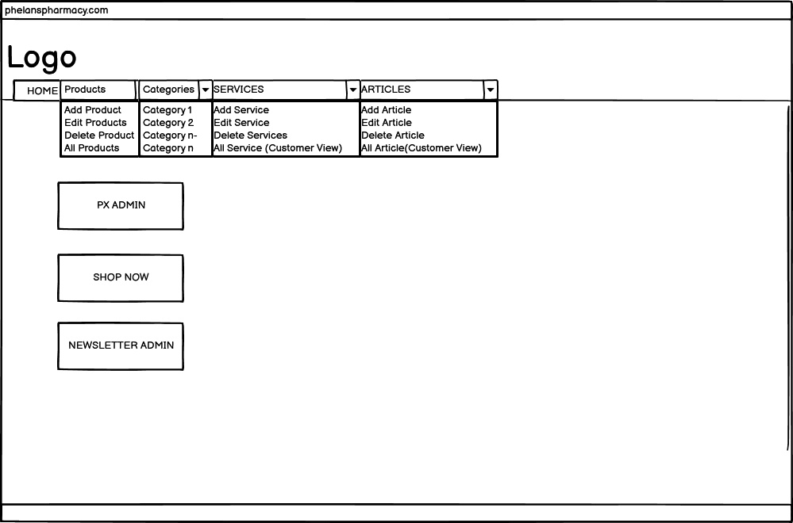
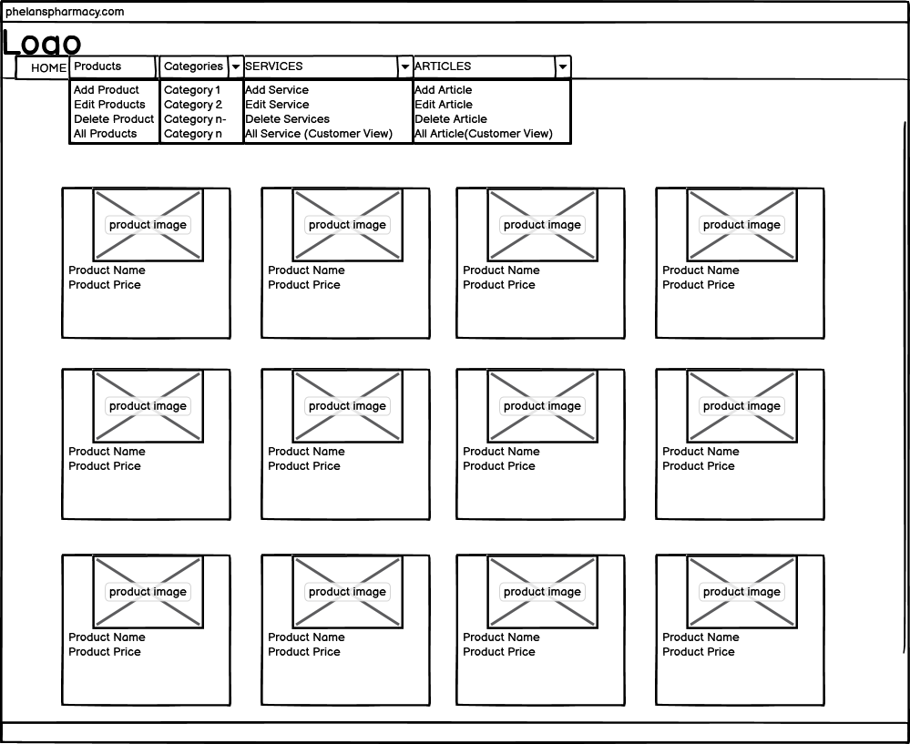
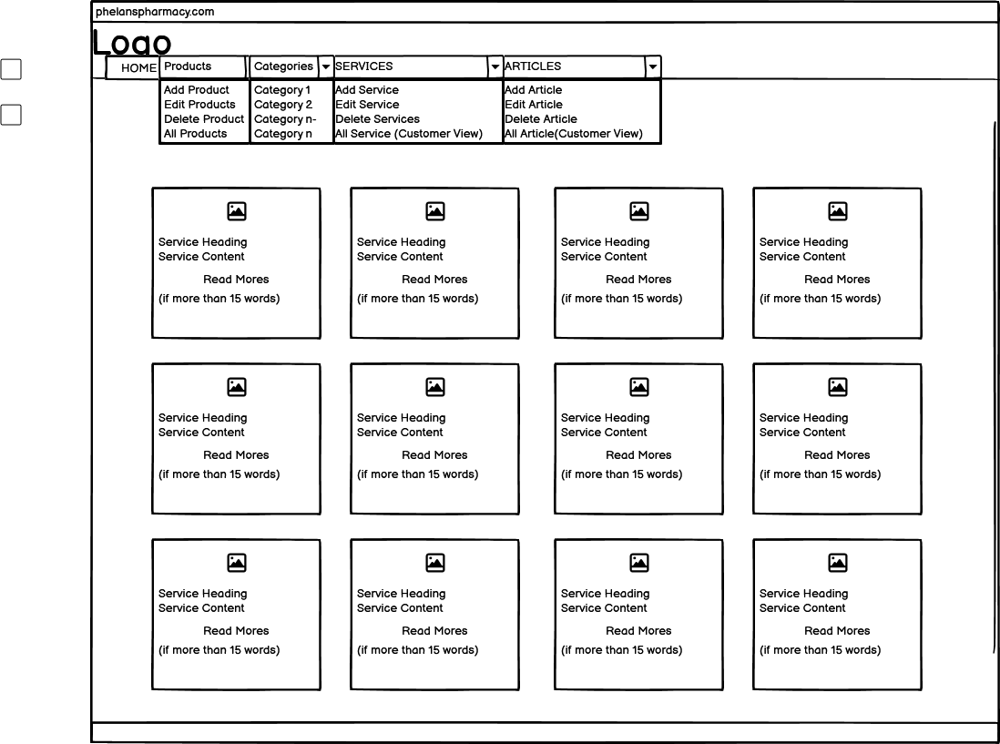
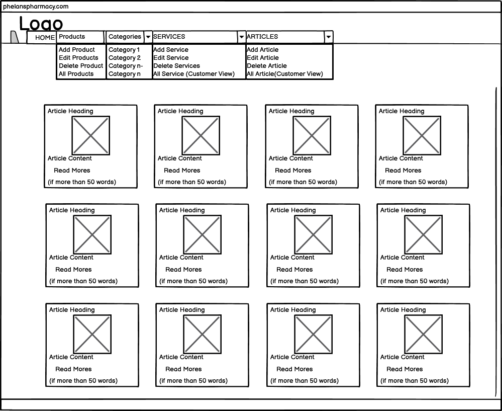
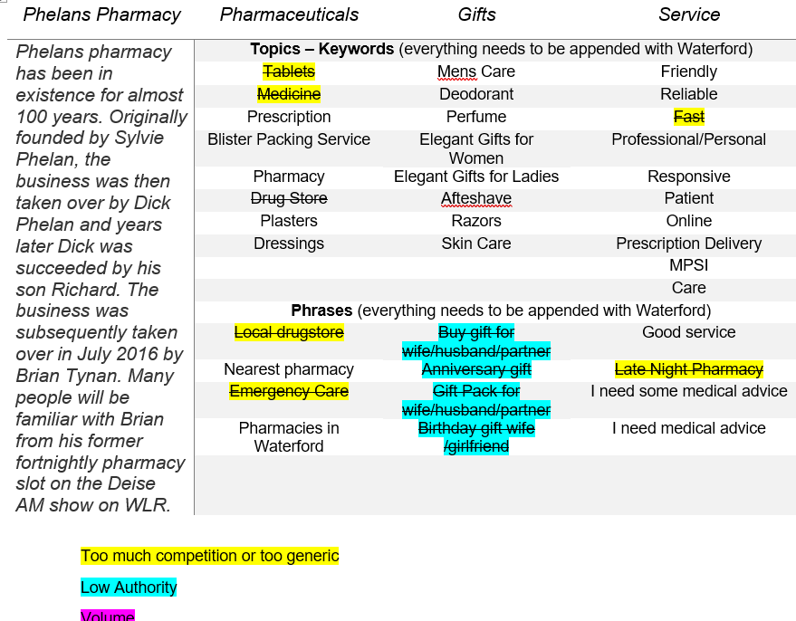

## Project Background

Overview

- This Django web development project is an extension of Code Institute, "Boutique Ado". 
- Phelans pharmacy already have a website: https://phelanspharmacy.com/.  While they are happy enough with it, the main problem which prevents them from leveraging it is that, Managing the Content just takes too long! In consultation with the owner, we decided that we would undertake a two epic, four persona revamp.

Epics:

 
- Epic 1: to replicate the site as is, not exactly, but enough to easily see the overlaps to appreciate the extra functionality provided in Epic 2.
- Epic 2: to add CRUD to Prescription (PX) Management, Product Management, Service Management and Article Managment.  Epic 2 would enable to team in Phelans Pharmacy to keep the site updated without having to engage the services of a Developer.
- Epic 3: Out of scope for this project, would be a Full Migration of all existing features in the current site and add a few more such as spcific reports to deal with increased PX and Product Orders

Personas:

- Persona 1: Site Owner AUX (is_superuser with access to /Admin)
- Persona 2: Team Member TUX (is_staff Access to CRUD on the frontend)
- Persona 3: Registered User RUX (Anonymous User with a Profile)
- Persona 4: Anonymous User UX (Access to view everything)

## READMEs

READMEs

 - [CART README](cart/_docs/README.md)
 - [CHECKOUT README](checkout/_docs/README.md)
 - [HOME README](home/_docs/README.md)
 - [PHARMACY README](pharmacy/_docs/README.md)
 - [PRESCRIPTION README](prescription/_docs/README.md)
 - [PRODUCTS README](products/_docs/README.md)
 - [PROFILES README](profiles/_docs/README.md)

## Agile Methodology

Personas
 

-	Persona 1: Site Owner AUX (is_superuser with access to /Admin)
-	Persona 2: Team Member TUX (is_staff Access to CRUD on the frontend)
-	Persona 3: Registered User RUX (Anonymous User with a Profile)
-	Persona 4: Anonymous User UX (Access to view everything)

Github
 
Github was used for Planning, Recording and Sharing of all aspects of the project:

The [Project Elements:](https://github.com/users/DMASCoreDeclan/projects/23)
- [Code Repository](https://github.com/DMASCoreDeclan/PP5-Pharmacy)
- [Version Control](https://github.com/DMASCoreDeclan/PP5-Pharmacy/commits/main/) was used for version control of the code.  Regular [commits](https://github.com/DMASCoreDeclan/PP5-Pharmacy/commits/main/) were created.  Where possible each commit was isolated to either a specific Issue but may have occassionally also included a minor change to some other part of the code
- [Epics](https://github.com/users/DMASCoreDeclan/projects/23/views/2)
- [User Stories](https://github.com/users/DMASCoreDeclan/projects/23/views/4)
- [Kanban](https://github.com/users/DMASCoreDeclan/projects/23)
- [Labels](https://github.com/DMASCoreDeclan/PP5-Pharmacy/labels)
- [MoSCow](https://github.com/users/DMASCoreDeclan/projects/23/views/3) Priorities are based on the MoSCoW method (Must have, Should have, Could have, Won't have)

## Wireframes Epic 2
[Designed with Balsamiq Wireframes for Desktop](https://balsamiq.com/wireframes/desktop/)

Epic 1 Wireframes were not prepared as the layout was determined by the [Phelans Pharmacy Site](https://phelanspharmacy.com)

Any vistor who has the URL can see the home screen [Phelans | the Friendliest Pharmacy Wateford](https://phelans-pharmacy-bf69b3045245.herokuapp.com/)

  
Epic 2 Wireframes with corresponding URLs
 

  

  
TUX Home Screen
  
  
  [TUX Home Screen](https://phelans-pharmacy-bf69b3045245.herokuapp.com/)
  
  
  

  

  
TUX Products
  
  
  [Products](https://phelans-pharmacy-bf69b3045245.herokuapp.com/products/)
  
  

  

  

  
TUX Add Product
  
  
  [Add Products](https://phelans-pharmacy-bf69b3045245.herokuapp.com/products/add/)

  
  
  

  

  
TUX Edit Products
  
  
  [Edit Products](https://phelans-pharmacy-bf69b3045245.herokuapp.com/products/edit_products/)

  
  
  

  

  
TUX Delete Products
  
  
  [Delete Product](https://phelans-pharmacy-bf69b3045245.herokuapp.com/products/delete_products/)

  
  
  

  

  
RUX Send Prescription
  
  
  [Send Prescription](https://phelans-pharmacy-bf69b3045245.herokuapp.com/prescription/)

  
  
  

  

  
TUX View Prescriptions
  
  
  [View Prescriptions](https://phelans-pharmacy-bf69b3045245.herokuapp.com/prescription/px_admin)

  
  
  

  

  
TUX Update Prescriptions
  
  
  [Update Prescriptions](https://phelans-pharmacy-bf69b3045245.herokuapp.com/prescription/edit_px_status/10)

  
  
  

  

  
TUX Services
  
  
  [Services](https://phelans-pharmacy-bf69b3045245.herokuapp.com/all_services/)
  
  

  

  

  
TUX Add Service
  
  
  [Add Services](https://phelans-pharmacy-bf69b3045245.herokuapp.com/add_service/)

  
  
  

  

  
TUX Edit Services
  
  
  [Edit Services](https://phelans-pharmacy-bf69b3045245.herokuapp.com/edit_services/)

  
  
  

  

  
TUX Delete Services
  
  
  [Delete Service](https://phelans-pharmacy-bf69b3045245.herokuapp.com/delete_services/)

  
  
  

  

  
TUX Articles
  
  
  [Articles](https://phelans-pharmacy-bf69b3045245.herokuapp.com/all_articles/)
  
  

  

  

  
TUX Add Article
  
  
  [Add Articles](https://phelans-pharmacy-bf69b3045245.herokuapp.com/add_article/

  
  
  

  

  
TUX Edit Articles
  
  
  [Edit Articles](https://phelans-pharmacy-bf69b3045245.herokuapp.com/edit_article/)

  
  
  

  

  
TUX Delete Articles
  
  
  [Delete Article](https://phelans-pharmacy-bf69b3045245.herokuapp.com/delete_articles/)

  
  
  

 
 

 
## Entity Relationship Diagram
[Designed with Lucidchart](https://www.lucidchart.com/pages/)

ERD
  

Project - Pharmacy

Pharmacy is the django Project. By default it uses SQLite but we're using PostgreSQL instead.  
There are six apps within the project:

1. cart
1. checkout
1. home
1. prescription
1. products
1. profiles
1. external apps

  

  
App - cart

  
  - `cart` views: `cartview`, `add_to_cart`, `adjust_cart`, `remove_from_cart` 
  - `cart` pages: `cartview.html`
  

  

  
App - checkout

  - `checkout` models: `Order`, `OrderLineItem`
  - `checkout` forms: `OrderForm`, 
  - `checkout` views: `cache_checkout_data`, `checkout`, `checkout_success`
  - `checkout` pages: `checkout_success.html`, `checkout.html`
  

  

  
  
App - home

  
  - `home` models: `CommunicationStatus`, `CommunicationType`, `CommunicationContent`, `Service`
  - `home` forms: `CommunicationForm`, `ServiceForm`, `PxChangeStatusForm`
  - `home` views: `index`, `subscribe`, `all_articles`, `add_article`, `edit_article`, `article_detail`, `delete_article`, `delete_articles`, `edit_articles`, `all_services`, `edit_service`, `edit_services`, `service_detail`, `delete_services`, `about`
  - `home` pages:  `custom_clearable_file_input.html`, `about.html`, `add_article.html`, `add_service.html`, `all_articles.html`, `all_services.html`, `article_detail.html`, `confirm_delete_article.html`, `confirm_delete_service.html`, `delete_articles.html`, `delete_services.html`, `edit_article.html`, `edit_articles.html`, `edit_service.html`, `edit_services.html`, `index.html`, `subscribe.html`, `service_detail.html`,  
  

  

  
  
App - prescription

  
  - `prescription` models: `Prescription`
  - `prescription` forms: `PxForm`, `PxAdminForm`, `PxChangeStatusForm`,
  - `prescription` views: `order_px`, `px_admin`, `edit_px_status`
  - `prescription` pages:  `px_order.html`, `px_order.html`, `prescription_history.html`, `edit_px_status.html`, `custom_clearable_file_input.html`
  

  

  
App - products

  
  - `products` models: `Category`, `Product`, `ProductBundle`, 
  - `products` forms: `ProductForm`
  - `products` views: `profiles`, `order_history`, `px_order_history`, `prescription_history` 
  - `products` pages:  `products.html`, `product_detail.html`, `edit_products.html`, `edit_product.html`, `delete_products.html`, `confirm_delete_product.html`, `add_product.html`, `quantity_input_script.html`, `product_bundle_picture.html`, `edit_product_bundle_picture.html`, `custom_rating_input_validation.html`, `custom_clearable_file_input.html`
  

  

  
App - profiles

  - `profiles` models: `UserProfile`
  - `profiles` forms: `UserProfileForm`
  - `profiles` views: `profiles`, `order_history`, `px_order_history`, `prescription_history` 
  - `profiles` pages: `profile.html`
  

  
## Testing

Test Case and Test Scenario

- All testing is manual.
- All testing took place on the deployed site in an incognito Chrome window.  A random selection of the tests were also carried out in Firefox and MS Edge to check the console.
- I logged into every URL and every Form as a UX, RUX, TUX and AUX.  After each action, I checked the console, and where appropriate, I checked the databae in /admin, to ensure the backend did as expected.  
- I performed 64 [Unit Tests and Scenario Tests](https://github.com/DMASCoreDeclan/PP5-Pharmacy/blob/main/_docs/TESTING_REPORT.md) 
- During the testing
	1. **Easy** to fix, misspellings or obvious omissions, in .html/.py/.js/.css.  These fixed on the fly and captured in a commit
	1. **Substantial** and may or may not be fixed.  These have a [Bug Issue in Github](https://github.com/users/DMASCoreDeclan/projects/23/views/9?filterQuery=bug&sliceBy%5BcolumnId%5D=Status)

Responsiveness

- The website was viewed on a variety of devices such as Desktop, Laptop, iPhone 8, iPhone 11, iPad, and Androids to ensure responsiveness on various screen sizes. The website performed as intended. The responsive design was also checked using Chrome developer tools across multiple devices with structural integrity holding for the various sizes.
- Unfortunately, it seems that [AmIResponsive](https://ui.dev/amiresponsive?url=https://phelans-pharmacy-bf69b3045245.herokuapp.com/) and [Responsinator](http://www.responsinator.com/) can no longer check Heroku hosted apps.  
- Both sites yield the following Console Error: "chromewebdata/:1 Refused to display 'https://phelans-pharmacy-bf69b3045245.herokuapp.com/' in a frame because it set 'X-Frame-Options' to 'deny'."

Code CI Python Linter

[CI Python Linter](https://pep8ci.herokuapp.com/) showed several errors which have been remedied in [Commit 192](https://github.com/DMASCoreDeclan/PP5-Pharmacy/commit/1e14b7d6f93c62d667c7e2123326ddbf542c598e)

W3C CSS Validator Result

No errors were returned when passing through the official W3C CSS Validator

[W3C CSS Validator Result](https://jigsaw.w3.org/css-validator/validator?uri=https://phelans-pharmacy-bf69b3045245.herokuapp.com/)

W3C Markup Validator

Positive validation from Nu Html Checker

## SEO

Phelans Pharmacy Keyword Research

  

  
SEO High Level Strategy

  
 - Mention Waterford City, Waterford, Ireland
 - A Weekly Change – Edit/Add/Remove Product, Edit/Add/Remove Article, Add Newsletter
 - Link to Irish Pharmacy Page, Pharmacy Advertising Guidelines, Owners LinkedIn.  LinkedIn to Phelans Pharmacy, Social Media
 - In Products, link to product Brand and the Product name.  Have an Article on the Brands you stock, 
 - In Product Detail place the Brand Name and Product Name in the TITLE
 - BOLD Brand Names
 - Make sure product details have title=”” and alt=”” wherever possible
 - Make the UX and content appealing to a human Google Rater

  

  

  
Keyword Strategy

  
- The site is bound by the Pharmaceutical Advertising Laws and Regulations Ireland  In essence, we can only advertise our non medical products, services and our ability to delivery any service ie we are friendly.
- Social Media, Newsletters and Blog Articles would be the best.
- Our customers are not online social media users for Medicines, only for gifts and other non medical products and services.
- However, announcing a new service or the availability of a service should be marketed.  For example, a campaign saying “Latest Flu vaccine appointments are available from 25/10/5/today time, book your appointment here . . .” would be allowed
- We want to rank highly for anything that we sell within a 15 mile radius.  
- We do not deliver non medical products, we DO deliver medical products.  
- All our services are consumed within the confines of the premises.  Our products are available either at a competing pharmacy or in the case of non medical products, in supermarkets.  There is nothing distinguishable about what we sell EXCEPT HOW we deliver it – Service.  
- We want to distinguish ourselves from our competitors, who are bound by the same constraints by:
 
  •	Being the preferred provider of services to be consumed on site
  
  •	Converting first time service customers to repeat medical product customers

  

  

  
Implementation

  
  •	Strategic use of semantics without keyword stuffing:

  •	Articles and Product should be in bold H1s with < title > and < alt > being populated.

  •	Articles, Services and Products should have keyword decriptions URLs (Use Slugs instead of PKs/IDs)

  •	URLS to Images: descriptive-image-names.jpg.  (Using and image description in the model would have been more useful)

  •	Apply ARIA rules where possible

  •	META Data in < head >: < title >, < description > and < keywords > (Keywords should be stuffed)

  

## Deployment

### Local Deployment  
1. [Clone the repository from GitHub](https://github.com/DMASCoreDeclan/PP5-Pharmacy.git) by clicking the "Code" button and copying the URL.
2. Open your preferred IDE and open a terminal session in the directory you want to clone the repository to.
3. Type `git clone` followed by the URL you copied in step 1 and press enter.
4. Install the required dependencies by typing `pip install -r requirements.txt` in the terminal.
5. Note: The project is setup to use environment variables. You will need to set these up in your local environment. See [Environment Variables](_docs/env_sample.py) for more information.
6. Connect your database of choice and run the migrations by typing `python manage.py migrate` in the terminal.
7. Create a superuser by typing `python manage.py createsuperuser` in the terminal and following the prompts.  YOU MUST create a superuser called "Admin" to have the frontend features
8. Optional: Load blog articles `python manage.py loaddata products/fixtures/categories.json` and `python manage.py loaddata products/fixtures/products.json`.
9. Run the app by typing `python manage.py runserver` in the terminal and opening the URL in your browser.

### Heroku Deployment
1. Login to the Heroku dashboard and create a new app.
2. Connect your GitHub repository to your Heroku app.
3. In the Settings tab, ensure that the [Python Buildpack](_docs/heroku-config-vars.png) is added.  
4. Set environment variables in the Config Vars section of the Settings tab, detailed below.
5. In the Deploy tab, enable automatic deploys from your GitHub repository.
6. Click the "Deploy Branch" button to deploy the app.
7. Once the app has been deployed, click the "Open App" button to view the app.

###  Environment Variables
- For local deployment, you will need to create a `.env` file in the root directory of the project and set the environment variables in this file.
- For Heroku deployment, you will need to set the environment variables through the Heroku CLI or through the Heroku dashboard under 'Config Vars'.  In addition, you will need an [AWS Account](https://eu-west-1.console.aws.amazon.com/s3/buckets?region=eu-west-1&bucketType=general&region=eu-west-1) to setup AWS Buckets, an [Email Account](https://support.google.com/mail/answer/56256?hl=en) for sending emails and a [Stripe Account](https://dashboard.stripe.com/apikeys) to connect to Stripe.  Setting up these Accounts and their components is beyond the scope of this README.  However should you have all of these accounts, you need to define the following variables:
  - If using a Postgres database:
    - `DATABASE_URL` - the URL for your Postgres database.
    AWS Keys to be obtained from your account and poplated in Heroku
    - `AWS_ACCESS_KEY_ID` - 
    - `AWS_SECRET_ACCESS_KEY` -
    - `USE_AWS` - 
    - `AWS_STORAGE_BUCKET_NAME` - 
    - `AWS_S3_REGION_NAME` - 
    - `AWS_S3_CUSTOM_DOMAIN` - 
    Email Keys to be obtained from your account and poplated in Heroku
    - `EMAIL_HOST_PASS` - 
    - `EMAIL_HOST_USER` - 
    DJANGO Key to be obtained from settings.py of your project and poplated in Heroku
    - `SECRET_KEY` - 
    Stripe Keys to be obtained from your account and poplated in Heroku
    - `STRIPE_PUBLIC_KEY` - 
    - `STRIPE_PUBLIC_KEY_LIVE` - 
    - `STRIPE_SECRET_KEY` - 
    - `STRIPE_SECRET_KEY_LIVE` - 
    - `STRIPE_WH_SECRET` - 

## Credits

**
Credits
**

- Antonio, my mentor 
- Code Institute for the foundation of Epic 1: "Boutique Ado!"

**May 16, 2024**